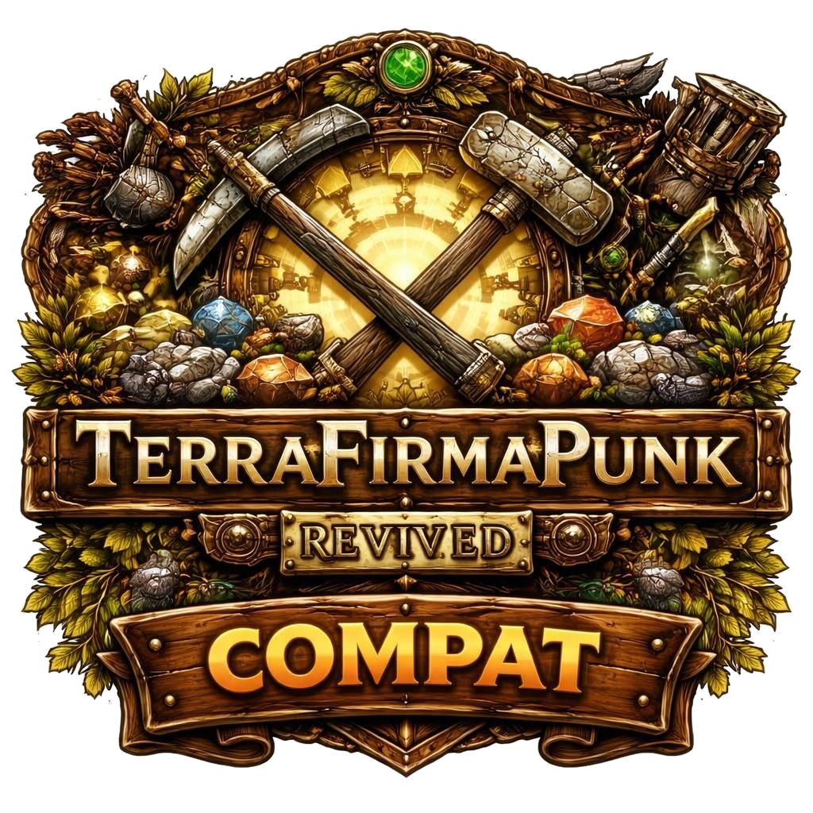

<p align="center">
  
</p>

# TerraFirmaPunk Revived Compat

A NeoForge 1.21.1 data mod that makes every crafting recipe in the **TerraFirmaPunk Revived - ColoniesEdition** modpack completable using only resources provided by [TerraFirmaCraft](https://modrinth.com/mod/terrafirmacraft) (TFC).

---

## Why this exists

TFC replaces vanilla ore and material generation entirely. Vanilla items like `minecraft:iron_ingot`, `minecraft:cobblestone`, `minecraft:smooth_stone`, and `minecraft:andesite` are either unobtainable or replaced by TFC-specific equivalents. This breaks hundreds of recipes across mods that were written for vanilla Minecraft.

This mod ships JSON recipe overrides that redirect those broken recipes to the correct TFC items and tags — without touching any game code.

**Why a mod and not a datapack?** Mods load automatically for all worlds and are distributable on Modrinth/CurseForge. A datapack must be manually added to every new world.

---

## Requirements

- Minecraft 1.21.1
- NeoForge 21.1.x
- TerraFirmaCraft 3.x
- ArborFirmaCraft (AFC) — required for wood recipe alternatives

All other mods listed below are optional. Overrides for each mod only activate when that mod is present (`neoforge:mod_loaded` conditions).

---

## What is covered

### Create

| Recipe | Change |
|--------|--------|
| Andesite alloy (crafting + mixing, ×4) | `minecraft:andesite` → `tfc:rock/raw/andesite` |
| Redstone contact | `minecraft:cobblestone` → `#c:cobblestones` |
| Pulse timer | `minecraft:amethyst_shard` → `tfc:gem/amethyst` |
| Schematic table | `minecraft:smooth_stone` → `#tfc:rock/smooth` |
| Schematicannon | `minecraft:smooth_stone` → `#tfc:rock/smooth`; `minecraft:iron_block` → `#c:storage_blocks/iron` |
| 16× postboxes | `minecraft:barrel` → `tfc:wood/barrel` |
| Crafting blueprint, Mechanical crafter | `minecraft:crafting_table` → `tfc:wood/workbench` or `afc:wood/workbench` |
| Item drain | `minecraft:iron_bars` → `tfc:metal/bars/wrought_iron` |
| Item hatch | `minecraft:iron_trapdoor` → `tfc:metal/trapdoor/wrought_iron` |
| Track observer | `minecraft:stone_pressure_plate` → `#tfc:rock/smooth` |
| Pressing iron ingot | result → `tfc:metal/sheet/wrought_iron` |
| Pressing brass / gold ingot | result → `tfc:metal/sheet/brass` / `tfc:metal/sheet/gold` |
| Blasting / smelting crushed iron | result → `tfc:metal/ingot/wrought_iron` |
| Blasting / smelting zinc (crushed, ore, raw ore) | result → `tfc:metal/ingot/zinc` |
| Zinc ingot compacting / decompacting | result → `tfc:metal/ingot/zinc` |
| Brass ingot compacting / decompacting | result → `tfc:metal/ingot/brass` |
| Brass alloy mixing | result → `tfc:metal/ingot/brass` ×2 |
| Iron horse armour crushing | iron ingot results → `tfc:metal/ingot/wrought_iron` |
| Precision mechanism | `create:golden_sheet` → `tfc:metal/sheet/gold`; iron ingot → `tfc:metal/ingot/wrought_iron` |

**Disabled** (TFC progression conflict): cardboard sword/armour, cardboard boots, potato cannon*, copper diving armour, netherite diving armour, wrench*

*potato cannon and wrench were later restored — see Create Stuff Additions section.

---

### Create Addons

#### Copycats+
All 4 copycat recipes: `create:zinc_ingot` → `tfc:metal/ingot/zinc` as ingredient.

#### Create: Bells & Whistles
5 recipes fixed: iron / brass sheet ingredients redirected to TFC equivalents; smooth stone and smooth slab tags corrected; vanilla iron nugget namespace bug fixed.

#### Create: Colonies
Workbench ingredient: `#minecraft:planks` → `[#tfc:wood/planks, #afc:wood/planks]`.

#### Create: Dragons Plus
`minecraft:cobblestone` → `#tfc:rock/cobble`; `minecraft:stone_bricks` → `#tfc:rock/bricks`.

#### Create Stuff Additions
- Restored as TFC-compatible: flamethrower, portable drill, andesite/brass/copper exoskeleton chestplates, potato cannon, wrench (original recipes already use `#c:` convention tags).
- Brass drill head: `create_sa:brass_pickaxe` ingredient → `tfc:metal/pickaxe/brass`.
- Netherrack recipe: `minecraft:cobblestone` → `#tfc:rock/cobble`.
- Steam engine: `create:brass_sheet` byproduct → `tfc:metal/sheet/brass`.

**Disabled** (61 total — TFC provides its own progression-gated tools and armour):
- Create (11): cardboard sword, cardboard armour set, copper / netherite diving armour
- Create Confectionery (5): candy cane sword, axe, pickaxe, shovel, hoe
- Create Stuff Additions (45): brass/copper/zinc/experience/rose quartz/blazing tool sets; flamethrower weapons; portable drill; brass / copper / zinc / slime armour sets; iron haunting recipes

#### Create: Ultimate Factory
7 recipes: `minecraft:cobblestone` → `#tfc:rock/cobble`; `minecraft:gravel` → `#tfc:rock/gravel`.

#### Create Sifter
11 recipes:
- Mesh recipes: planks → `[#tfc:wood/planks, #afc:wood/planks]`; `create:brass_ingot` / `create:brass_sheet` → TFC equivalents
- Sifting inputs: `minecraft:sand` → `#tfc:sand`; `minecraft:gravel` → `#tfc:rock/gravel`
- Gravel (advanced brass): outputs include `tfc:ore/diamond`, `tfc:ore/emerald`, `tfc:gem/amethyst`
- Stone pebble conversion disabled when TFC is loaded (vanilla cobblestone unobtainable)

#### Create: Enchantment Industry
Advancement override: `create:brass_ingot` → `tfc:metal/ingot/brass` in inventory trigger.

---

### Waystones
`minecraft:stone_bricks` → `#tfc:rock/bricks`; `minecraft:amethyst_shard` → `tfc:gem/amethyst`; `minecraft:chiseled_sandstone` → `tfc:cut_sandstone/yellow`; `minecraft:mossy_stone_bricks` → `#tfc:rock/mossy_bricks`.

---

### Sophisticated Storage
`minecraft:smooth_stone` → `#tfc:rock/smooth` in blasting upgrade and auto-blasting upgrade.

---

### MineColonies + Structurize
Supply camp deployer: added `afc:wood/chest` alongside `#c:chests`.
Supply ship deployer: added `afc:wood/boat` alongside `#minecraft:boats`.
Build Tool (sceptergold): `#minecraft:stone_crafting_materials` → `#tfc:rock/cobble` + `#tfc:rock/raw`.
Steel scepter: `minecraft:iron_ingot` → `#c:ingots/iron`.
Shape tool: `minecraft:emerald` → `tfc:gem/emerald`.

---

### Domum Ornamentum
Architect's Cutter: `minecraft:stone_slab` → `#tfc:rock/smooth_slabs`; `minecraft:iron_ingot` → `#c:ingots/iron`.

---

### Gravestone
`minecraft:cobblestone` → `#tfc:rock/cobble`; `minecraft:dirt` → `#c:dirt`.

---

### Multi-Piston
`minecraft:stone` → `#tfc:rock/raw`.

---

### Etched
Radio and Etching Table: `minecraft:copper_ingot` → `#c:ingots/copper`; `#minecraft:planks` → `[#tfc:wood/planks, #afc:wood/planks]`.

---

### Macaw's Mods (partial)
Crafting tools that gate each mod's placement system are fixed:

| Mod | Tool fixed |
|-----|-----------|
| Macaw's Bridges | Pliers: `minecraft:iron_ingot/nugget` → `#c:ingots/iron` + `#c:nuggets/iron` |
| Macaw's Roofs | Roofing Hammer: same |
| Macaw's Windows | Window Hammer: same |

~985 remaining wood/stone recipe variants across all 8 Macaw's mods are **pending** (see below).

---

## What is still pending

| Area | Status |
|------|--------|
| Macaw's Mods — ~985 wood/stone variants | Blocked: needs TFC wood tag confirmation (`#tfc:wood/planks`, `#tfc:wood/logs`), AFC tag registration, and scripted generation |
| Macaw's Lights — 40 pure ingot substitutions | Straightforward once unblocked |
| Create: Crafts & Additions | Not yet audited |
| Vanilla recipe removals | Not yet started |
| Create Crushing Wheel for TFC ores | Quality-of-life addition, not a blocker |

---

## Mods with no overrides needed

These are already TFC-compatible or covered by a dedicated compat mod:

| Mod | Reason |
|-----|--------|
| Sophisticated Backpacks | Already uses `#c:` convention tags throughout |
| Farmer's Delight | Covered by Farmers TFC |
| Cuisine Delight | Covered by Cuisine TFC |
| Create (heating) | Covered by Powered TFC |
| MineColonies (base) | Covered by Better With Minecolonies |
| Sophisticated Backpacks ↔ Create | Covered by dedicated integration mod |
| ArborFirmaCraft | TFC tree addon — compatible by design |
| TFC Ore Washing, TFC Ambiental | TFC addons — compatible by design |

---

## Building

```bash
./gradlew build
```

The output JAR is in `build/libs/`. Drop it into a modpack instance alongside TFC and the target mods to test.

To release, push a tag in the form `v1.2.3` — GitHub Actions will build and create a draft GitHub release automatically.
